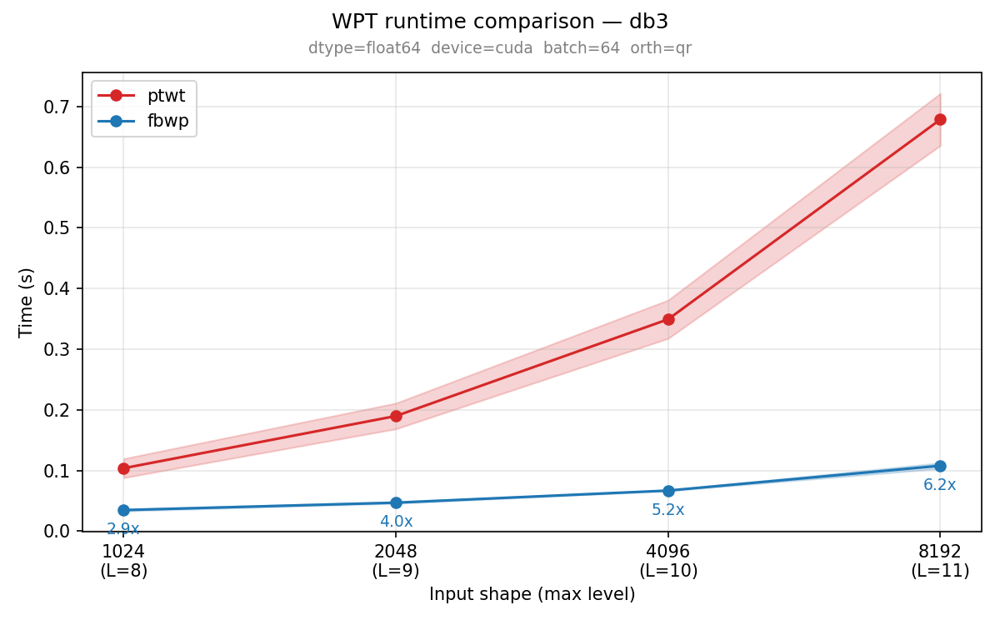
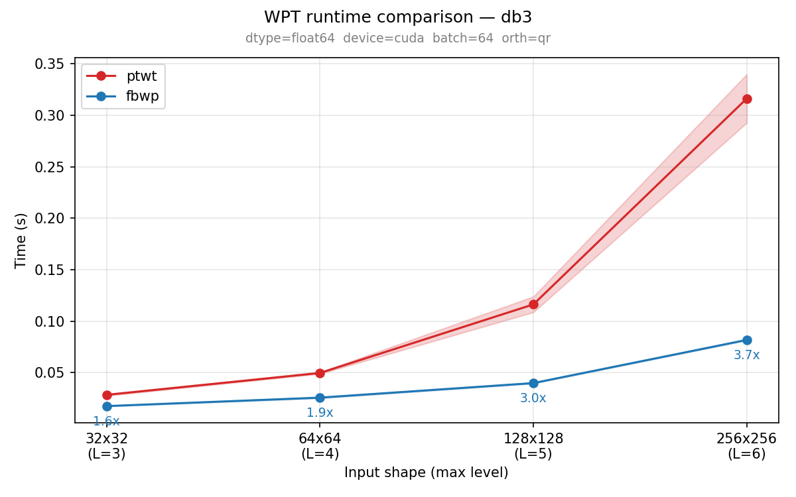

# fast-boundary-wavelet-packets 📦

**High-performance C++ (LibTorch) implementation of the wavelet packet transform with special boundary filters for finite-domain, perfectly reconstructible multi-scale analysis.**

## Motivation

Wavelet transforms are a fundamental tool for analyzing signals and images across multiple scales. They decompose data into localized frequency components, making it possible to capture both spatial structure and fine details.
The **wavelet packet transform** extends this idea by recursively decomposing not only low-frequency components but also high-frequency ones, leading to a richer and more flexible multi-scale representation.

### Why special boundary treatment is needed

Wavelet transforms are mathematically defined as if signals were **infinitely long**, but real inputs such as images are **finite**. At the borders, wavelet filters extend beyond available data, which becomes a serious issue for **higher-order wavelets** (like Daubechies).

Without proper boundary handling:

* ❌ **Perfect reconstruction can fail**: the transform may no longer be exactly invertible.
* ❌ **Artificial discontinuities** are introduced at the image edges.
* ❌ These errors are not just local: in a **multi-scale wavelet-packet decomposition**, boundaries are processed repeatedly, so small edge distortions grow into **strong artifacts**.
* ❌ Some naive fixes (like zero-padding) change the **number of coefficients**, which is impractical here because it would require different neural network architectures for different wavelets.

### Options for handling boundaries

| Method                       | What it does                            | Main drawback                                                             |
|------------------------------|-----------------------------------------|---------------------------------------------------------------------------|
| **Zero-padding**             | Assume signal is zero outside image     | Creates sharp artificial jumps at borders; increases coefficient count    |
| **Periodic extension**       | Wrap image around                       | Produces unrealistic seams unless edges match perfectly                   |
| **Symmetrization**           | Mirror signal at boundary               | Avoids value jumps but causes discontinuities in the **first derivative** |
| **Special boundary filters** | Replace edge filters with modified ones | More complex, but avoids artificial extensions                            |

### **Preferred approach: Gram–Schmidt boundary filters**

The paper uses **Gram–Schmidt boundary filters**, which:

* Modify filters **only near the edges**
* Use **shorter, specially constructed filters**
* Preserve:

    * ✅ **Signal length** (no extra coefficients)
    * ✅ **Perfect reconstruction**
    * ✅ Core wavelet properties (e.g., orthogonality)

Instead of faking data outside the image, this approach **adapts the transform to the finite domain**, preventing boundary artifacts while keeping the transform mathematically consistent and usable in their neural-network pipeline.

## Implementation Details

### Reference

The Wavelet Packet Transform with Gram-Schmidt boundary filters is included in the [PyTorch-Wavelet-Toolbox](https://github.com/v0lta/PyTorch-Wavelet-Toolbox).

This implementation supports **special boundary filters** by building explicit sparse analysis/synthesis matrices that treat edges differently from the interior.
With the option `mode="boundary"`, it replaces the usual edge convolutions with **short, specially constructed boundary filters** so the transform:

* preserves the original signal length (no extra coefficients), and
* satisfies **perfect reconstruction** / orthogonality constraints (so the inverse exactly recovers the input).

To ensure this, the library performs an orthogonalization step on the sparse filter matrices used near the edges.
Orthogonalization here means adjusting a set of vectors (or matrix rows/columns) so that they become mutually orthogonal.
This step is controlled by the `orthogonalization` argument, which selects between two algorithms for producing orthogonalized matrices:

* `"qr"`: use dense QR decomposition.
* `"gramschmidt"`: use a sparse Gram–Schmidt process.

#### Short mathematical background

A discrete wavelet (packet) transform can be written as a **linear operator**.
For an image vector `x`, the coefficients are computed as `c = A x`, where `A` is the **analysis matrix** whose rows correspond to wavelet basis functions (scaling + wavelet functions at different locations and scales).

Reconstruction uses a **synthesis matrix** `S`: `x = S c`.

For an orthogonal (or biorthogonal) wavelet transform, we require the **perfect reconstruction condition** `S A = I`, so the transform is exactly invertible.

#### Boundary filters as a linear-algebra problem

Instead of extending the signal, the library modifies the **operator**:

* Interior rows of `A` use standard wavelet filters.
* Boundary rows are replaced by **short, specially constructed filters** whose support lies fully inside the image.

These boundary rows are computed so that the full analysis matrix `A` still satisfies the algebraic constraints needed for invertibility, namely:

* rows spanning the same subspace as the original wavelet system on the finite domain,
* mutual orthogonality (or biorthogonality), enforced numerically, and
* preservation of signal length (no padding).

This turns boundary handling into an **orthogonalization problem**: the candidate boundary filter rows are adjusted so that the resulting matrix `A` forms a valid (bi)orthogonal transform basis. The library performs this step using either **QR decomposition** or **Gram–Schmidt orthogonalization**, depending on the selected option.

For further mathematical details, see **"Wavelets and filter banks" by Strang and Nguyen (1996)** and **"Ripples in mathematics: the discrete wavelet transform" by Jensen and la Cour-Harbo (2001)**.

### Implementation in C++ using LibTorch

This repository provides a focused C++ implementation of the **wavelet packet transform with special boundary filters** using LibTorch. It is based on the same mathematical principles as the reference library, in particular the boundary-filter formulation that preserves signal length and perfect reconstruction on finite domains.

The scope is intentionally limited to this transform. Other features of the reference library are not reimplemented. The boundary backend is included together with both orthogonalization strategies used to construct valid boundary filters:

* **QR-based orthogonalization** for numerically robust enforcement of the reconstruction constraints
* **Gram–Schmidt orthogonalization** as a memory-friendly alternative

Unlike the reference implementation, the wavelet packet tree is **not built lazily**. All decomposition levels up to `max_level` are computed in one pass and returned together.

At each level, individual subbands are downsampled and therefore have reduced spatial resolution.
However, by arranging all nodes of a level, meaning all filter paths of the filter bank, into a structured tiling over rows and columns, the coefficients of that level collectively form a representation with the **same overall spatial extent as the input**.
This makes it possible to stack decomposition levels along an additional tensor dimension that explicitly represents the scale.

### Separable 2-D transform

The 2-D wavelet packet transform in this library uses a **separable** approach: at each decomposition level, two independent 1-D boundary-filter transforms are applied, one along each spatial axis. The reference library (ptwt) also supports a **non-separable** mode, where a single 2-D analysis matrix is constructed via the Kronecker product of the two 1-D matrices and then orthogonalized jointly. This library implements only the separable mode.

For interior (non-boundary) samples, separable and non-separable produce identical results — applying 1-D transforms along each axis sequentially is mathematically equivalent to applying their Kronecker product. The two modes diverge **only at the signal boundaries**, because of how boundary filter rows are orthogonalized:

* **Separable**: Each 1-D analysis matrix has its boundary rows orthogonalized independently. The effective 2-D operator is the Kronecker product of two independently-orthogonalized 1-D matrices. Boundary handling along one axis is unaware of the other axis.
* **Non-separable**: The full 2-D matrix (Kronecker product of the two 1-D matrices) is formed first, then its boundary rows are identified and orthogonalized jointly. This couples the boundary corrections — in particular at corners, where both axes have boundary effects simultaneously.

Both approaches yield valid orthogonal analysis matrices with perfect reconstruction (`S A = I`), but the actual boundary filter coefficients differ. Orthogonalization of boundary rows is not unique: there are many valid orthonormal replacements for the boundary rows. The separable approach constrains the solution to be a product of independent 1-D solutions, while the non-separable approach has more degrees of freedom at the corners. As a result, the two modes produce **different wavelet packet coefficients** even though both are mathematically correct.

## Benchmarks

|                   1-D (batch=64)                    |                   2-D (batch=64)                    |
|:---------------------------------------------------:|:---------------------------------------------------:|
|  |  |


## Development Setup

### Prerequisites

* **C++17 compiler** — GCC ≥ 9.4, Clang ≥ 12, or MSVC ≥ 19.20
* **CMake** ≥ 3.18
* **LibTorch** ≥ 2.4 (see [Installing LibTorch](#installing-libtorch) below)
* **Python** ≥ 3.9 (for reference tests and comparison scripts)
* **Git**

### Installing LibTorch

LibTorch is the C++ distribution of PyTorch. It ships as a prebuilt archive — no pip or conda needed on the C++ side.

**1. Download the archive** from [pytorch.org/get-started/locally/](https://pytorch.org/get-started/locally/). Select:
* LibTorch
* Your OS (Linux / macOS / Windows)
* CPU or your CUDA version
* cxx11 ABI (recommended on Linux; use "Pre-cxx11 ABI" only if linking with older libraries)

**2. Set `TORCH_DIR`** to the `share/cmake/Torch` directory inside the extracted archive:
   ```bash
   export TORCH_DIR=~/libs/libtorch/share/cmake/Torch
   ```

You can put this in your shell profile or pass it directly to `make`:
   ```bash
   make build TORCH_DIR=~/libs/libtorch/share/cmake/Torch
   ```

### Quick start

```bash
# 1. Create and activate a Python virtualenv (your choice of tooling).
python -m venv .venv && source .venv/bin/activate

# 2. Clone reference repo + install Python deps.
make setup

# 3. Build the C++ project (point TORCH_DIR at your LibTorch cmake directory).
make build TORCH_DIR=~/libs/libtorch/share/cmake/Torch

# 4. Run tests.
make test
```

---

### Acknowledgement

This project is a focused C++ reimplementation of the boundary-filter wavelet packet transform from the [PyTorch-Wavelet-Toolbox (ptwt)](https://github.com/v0lta/PyTorch-Wavelet-Toolbox) by Moritz Wolter *et al.* This library owes its correctness to their work and uses ptwt as the reference and source of truth for verification.
